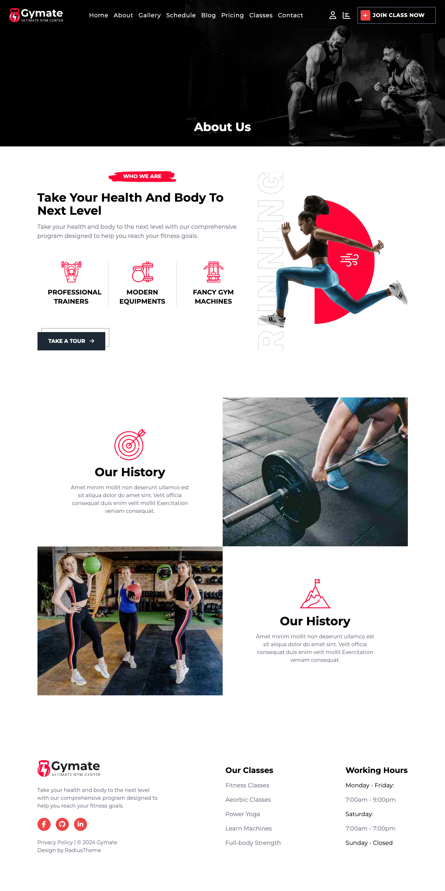
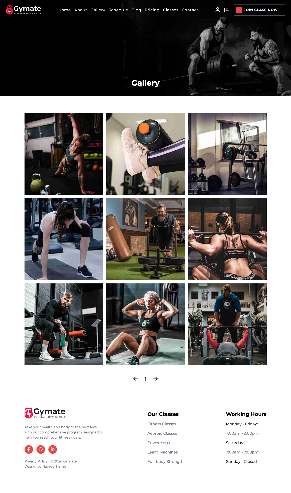
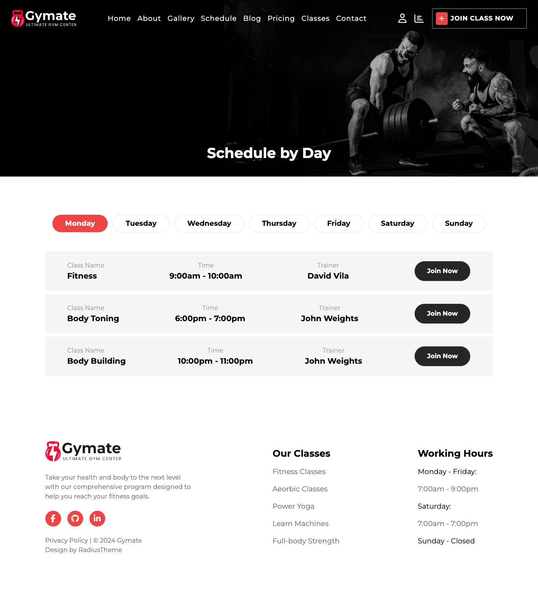
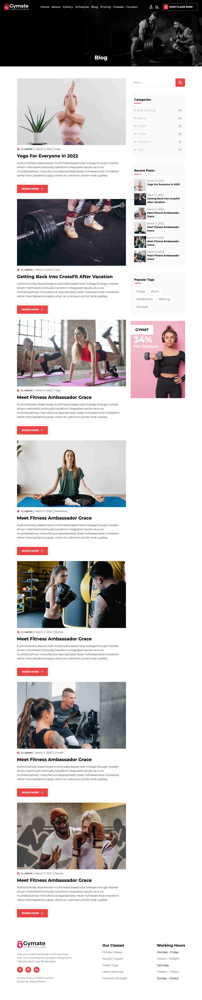
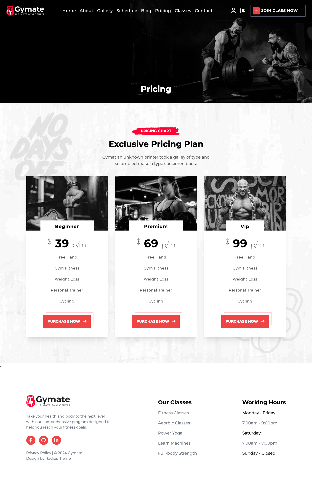
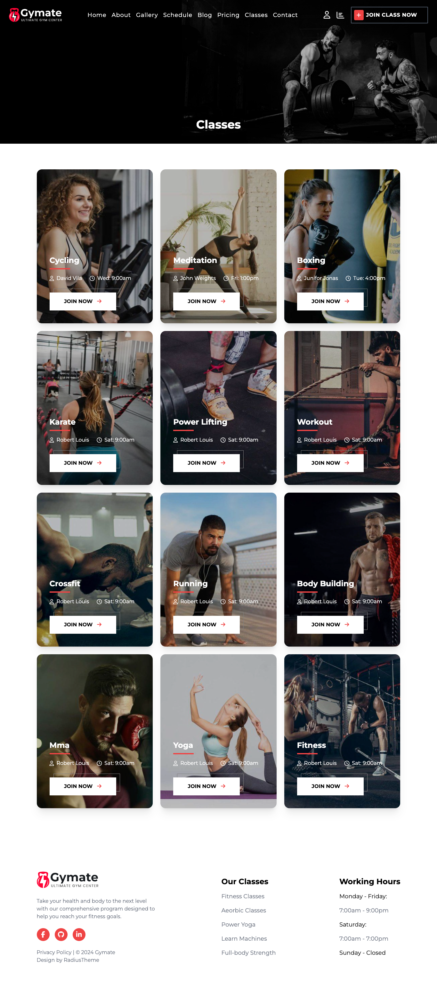
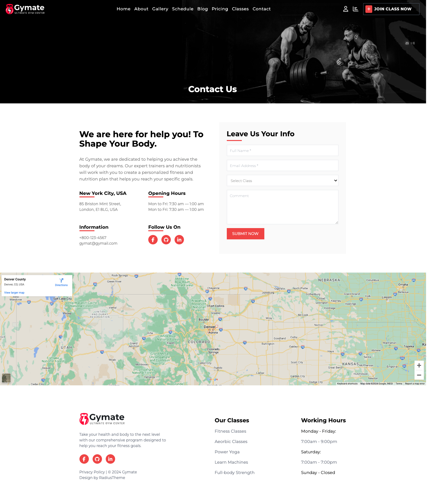

<h2>About the project</h2>

<b>Gymate</b> provides a space for people to improve their physical fitness and overall health through regular exercise and physical activity.

Credits for the design goes to <a href='https://www.radiustheme.com/'>RadiusTheme</a>

👉 Live Demo: <a href='https://gymate-ruby.vercel.app/'>Gymate Demo</a>

<h3>Build with:</h3>

» Tailwind CSS  
» React JS

<h2>Screenshots of the Project 📸</h2>
 

<h3 align='center'>Home Page 🏡</h3>

<h3 align='center'>About Page 🏡</h3>

<h3 align='center'>Gallery Page 🏡</h3>

<h3 align='center'>Schedule Page 🏡</h3>

<h3 align='center'>Blog Page 🏡</h3>

<h3 align='center'>Pricing Page 🏡</h3>

<h3 align='center'>Classes Page 🏡</h3>

<h3 align='center'>AbContactout Page 🏡</h3>

